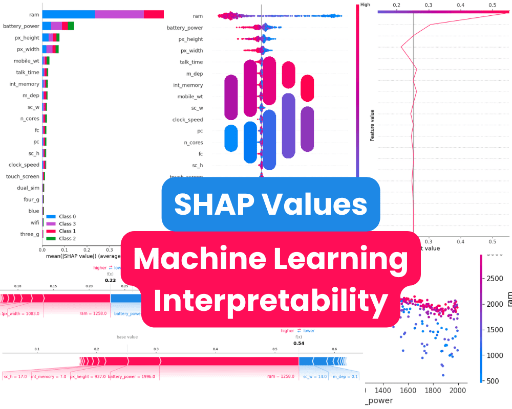

# Explainable AI with SHAP: Applications in Environmental Data Analysis

This repository contains materials for the **Environmental Data Analysis** course, developed by **Dr. Soheil Radfar**.

   
  <i>Image credit: 
    <a href="https://www.kdnuggets.com/2023/08/shap-values-model-interpretability-machine-learning.html">
      KDnuggets (2023)
    </a>
  </i>

## Learning Objectives

By the end of this session, you will be able to:
1. Understand the black-box nature of machine learning models and the need for interpretability
2. Explain the key concepts and methods in Explainable AI (XAI)
3. Understand SHAP theory and mathematical foundations
4. Apply SHAP to coastal engineering problems using Python
5. Interpret SHAP values and visualizations for model insights

## References

1. **Lundberg & Lee (2017)**: "A Unified Approach to Interpreting Model Predictions" (NeurIPS)
   - Original SHAP paper with theoretical foundations

2. **Lundberg et al. (2020)**: "From local explanations to global understanding with explainable AI for trees" (Nature MI)
   - TreeExplainer methodology and applications

3. **Molnar (2023)**: "Interpretable Machine Learning: A Guide for Making Black Box Models Explainable"
   - Comprehensive overview of XAI methods

## Instructor

**Dr. Soheil Radfar**  
Senior Scientist, The University of Alabama  
Email: [sradfar@ua.edu](mailto:sradfar@ua.edu)

For more details, refer to the course material.
